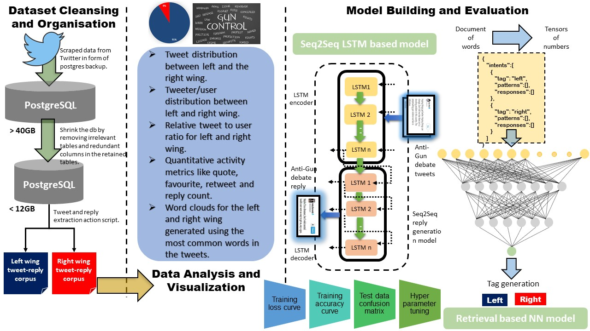
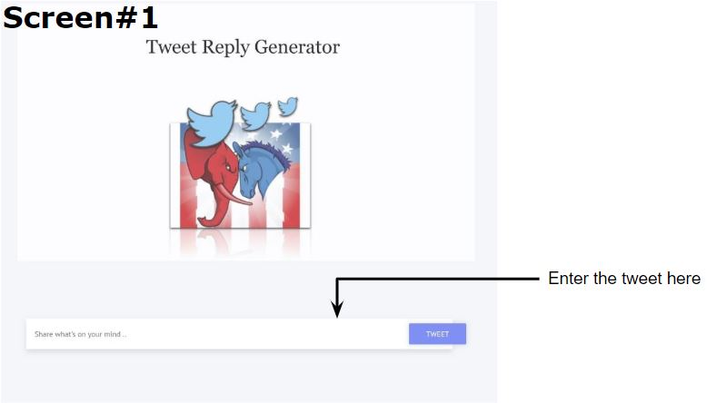
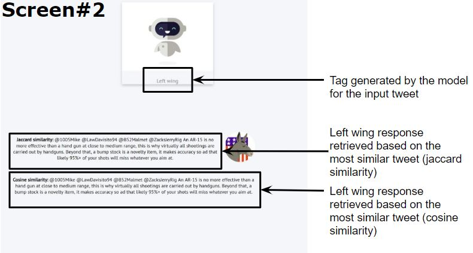

# TweetReplyPrediction

**Problem Statement:**

Given a tweet in a political context, the objective is to generate a reply which is either for or against the tweet i.e. left or right aligned based on the tweeters political inclination.

**Architecture Design:**

The reply generation system consists of following modules:

1) Dataset cleaning and organization: It involves data cleansing like reducing the size of data by removing unwanted objects from the database, extracting the tweetreply data and making data available to be consumed
by the models we build. It can be either in form of tab separated values with tweet and it’s corresponding reply or in form of a JSON structure specifying the tag for each pair of tweet-reply stored.

2) Data analysis and visualization: We analyze different statistical properties in the dataset like tweet count, user count, tweet to user distribution, quote count, reply count, retweet count and favorite count for the two wings - left and right and visualize the same through different plots and wordclouds.

3) Model building and evaluation: We take two approaches for building ours reply generation model - seq2seq LSTM based generative model and retrieval model. We evaluate the results of both the models and report the model metrics.

**Approaches taken:**

We explore two approaches for reply generation - generative approach and retrieval based. For the generative model, we used Seq2Seq neural network based text generation model. It consists of two parts, an encoder and a decoder, both of which are stacked LSTM layers. The encoder maps a variable-length source sequence to a fixed-length vector, and the decoder maps the vector representation back to a variable-length target sequence. The two networks are trained jointly to maximize the conditional probability of the target reply given a source tweet. We build two models — one using tweets which are antitopic and another using tweets for the topic. The entire tweet dataset corresponding to one of the ideologies is given as input to the encoder. During the training phase, the actual reply received for the original tweet is used for building a strong model, which continuously improves the objective function based on cosine similarity between the reply generated and actual reply. The model learns the context and the words used by the tweeters of a particular ideology. We also choose parameters like the number of LSTM layers, the size of each LSTM layer, batch size, learning rate, vocabulary size for the encoder and decoder and some checkpoints. For the retrieval based model, we transform the tab separated values for tweet-reply into a JSON structure having tags - left or right and corresponding tweets and replies nested under each of the tags. A neural network is trained using the processed data by converting the documents of words to tensors of numbers. Additionally we write a framework to process tweets and generate replies. The input tweet during the testing phase is translated into bag of words. The response processor predicts the tag for the tweet, and searches for the most similar tweet from the pool based on cosine similarity and jaccard similarity measures. It finally fetches the corresponding reply for the most similar tweet and returns the same.

**Implementation details:**

The dataset for the project is a postgresql dump of 40GB scraped for GunDebate topic.

The directory structure is as below:

    -> analysis: contains the data analysis plots for various dustributions in the dataset and the statistical properties associated with the tweets.
    
    -> codebase: contains the two approaches - generative model and retrieval model.
        
        -> driver.py: it has the REST APIs which act as wrapper over the backend model.
        
        -> generative_model.py: contains code for the seq2seq LSTM based model.
        
        -> tag_cloud.py: this was used to generate the gun shaped word clouds for 1000 tweets to visulaize the term frequency of words in the tweets from left and right wing.
        
        -> tweet_extractor.py: this script fetches tweet reply from the postgresql dump and stores the same as TSV.
        
        -> static: contains the related js, css, images for the user interface built for the retrieval model. 
        
        -> requirements.txt: lists the packages used.
        
        -> templates: 
        
            -> home.html: the initial screen where a user can enter the tweet
        
            -> chat_left.html: left winged response template
        
            -> chat_right.html: right winged response template
        
        -> retrieval_model:
        
            -> tflearn_logs: logs generated during training the model.
        
            -> checkpoint, model.tflearn.* : these files are used to load the trained model.
        
            -> intent.json: transformed TSV into JSON
        
            -> intent.py: the script to transform TSV into JSON
        
            -> intent_retrieval.py: retrieval model building/training code
        
            -> retrieval.py: response processor and retrieval model testing code
        
            -> topic_detection.py: LDA on the dataset for topic detection
    
    -> dataset
    
    -> images
    
    -> eval

**Software requirements**
Python 2.7+

Packages to be installed:
`nltk`
`numpy`
`sklearn`
`tensorflow`
`tflearn`
`gensim`
`seq2seq_lstm`
`matplotlib`
`wordcloud`
`pillow`
`psycopg2`
`flask`
`flask_cors`

or run the following command from codebase folder

`pip install -r requirements.txt`

**How to run?**

1) Retrieval model:

Interactive version -

`python driver.py`

or

`export FLASK_APP=driver.py`

`flask run`

Then open in browser the following default url and port on which the flask server listens:

eg. `http://0.0.0.0:5000/`

Following are the screens for the input tweet consumption and showing the response generated by the model:

Model training - 

`python intent_retrieval.py`

2) Generative model:

`python generative_model.py`
